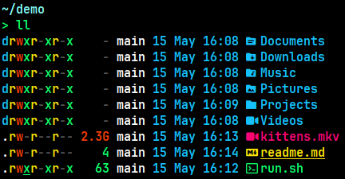
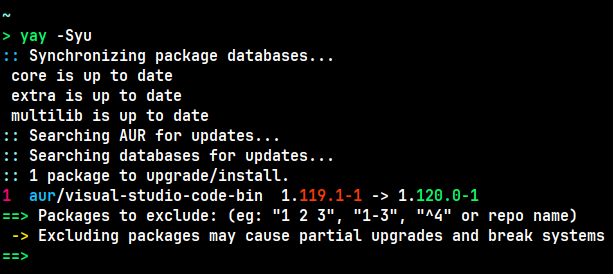
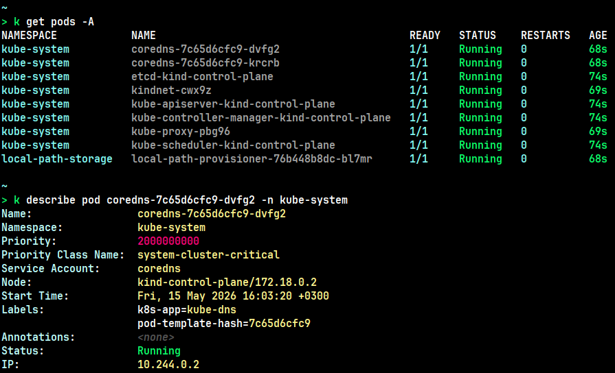

# xoff theme

Contrasting theme for the terminal with a black background (WCAG AA / AAA).

## Supported themes

| Software                                            | Theme                                    |
| :-------------------------------------------------- | :--------------------------------------- |
| [Alacritty](https://github.com/alacritty/alacritty) | [packages/alacritty](packages/alacritty) |
| [foot](https://codeberg.org/dnkl/foot)              | [packages/foot](packages/foot)           |
| [kitty](https://github.com/kovidgoyal/kitty)        | [packages/kitty](packages/kitty)         |

## Examples

[eza](https://github.com/eza-community/eza) with xoff theme:

[yay](https://github.com/Jguer/yay) with xoff theme:

[kubectl](https://github.com/kubernetes/kubectl) and [kubecolor](https://github.com/kubecolor/kubecolor) with xoff theme:

## Tools used

- [optipng](https://optipng.sourceforge.net/) - For assets optimizing.
- [prek](https://github.com/j178/prek) - ⚡ Better `pre-commit`, re-engineered in Rust.
- [Tombi](https://github.com/tombi-toml/tombi) - TOML Formatter / Linter / Language Server.

## License

This project is licensed under the terms of the [MIT](https://opensource.org/licenses/MIT) license (see [LICENSE](https://github.com/zsxoff/xoff-theme/blob/main/LICENSE) file).
